# Exercici 1
El primer exercici era simplement fer un for i un while per a una compta enrere del 10 al 0.  
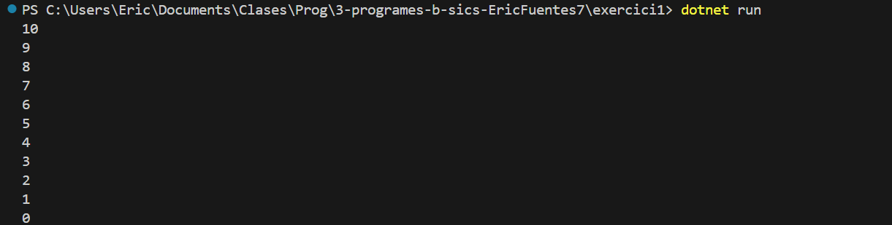

# Exercici 2
Aquest programa el que fa és agafar els primers 200 números senars, el que he fet és fer una variable int de 200, i al for li multipliquem per 2 (perquè surtin els 200 primers).  
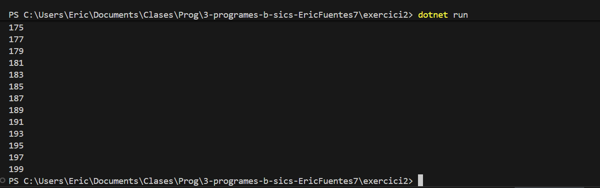

# Exercici 3
En aquest exercici el que he fet és assignar una variable random de dos números, i amb un while hem fet que quan el número arribi a 100 (o més), pari i et digui els intents que has fet.  
He fet que cada cop vagi d'1 a 7 (l’últim és -1, si poso 7 serà 6 el màxim) i sumar a una variable de llançaments.  
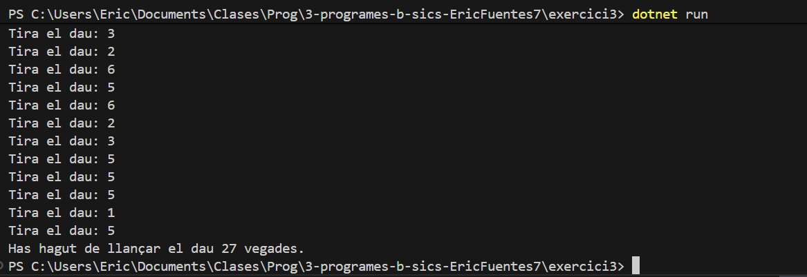

# Exercici 4
En aquest exercici el que es fa és un bucle for, que comença en 0 i va sumant els i fins que arriba al que ha dit l’usuari (amb +=).  
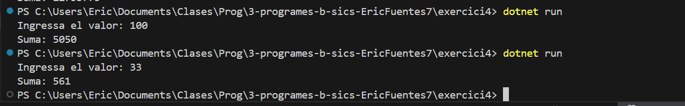

# Exercici 5
El que fem és recórrer la frase que insereix l’usuari (ho passem a minúscula), detecta el caràcter actual i l’anterior; si la combinació és "la", suma 1 al comptador.  
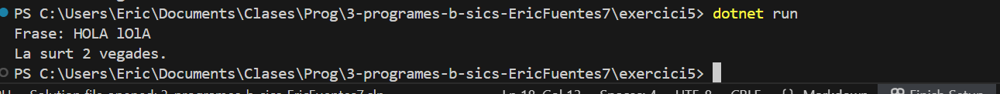

# Exercici 6
Aquest exercici era bastant més complicat. El que he fet és que si el valor no dona 0 amb mòdul de 10, torna a demanar; en cas que sí ho sigui, entra en un bucle que va fent mòdul de 10. Cada cop que s’executa, la variable elevatA suma 1 (i el valor es divideix entre 10 perquè no sigui infinit). I quan ja no es pugui fer mòdul, el valor és el valor de multiplicació.  
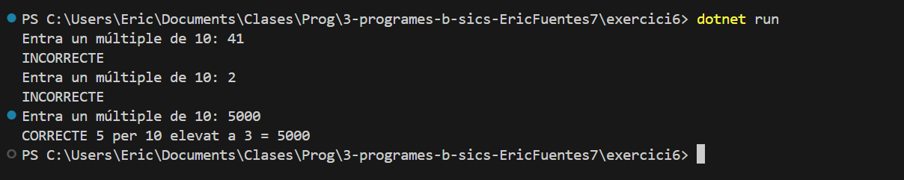

# Exercici 7
He fet un bucle foreach que busca en un array els caràcters i els cerca dins del text, el valor actual de i.  
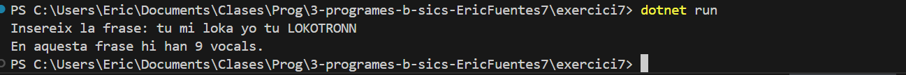

# Exercici 8
En aquest exercici el que he fet és un for dins d’un for; quan sigui el primer torn del primer, serà la línia, i en el del segon, el que ha de posar. En el 2, 2, serà línia 2 i hi posarà 2 (repetirà dues vegades).  
I després del primer for (a l’acabar el segon), posem un Console.WriteLine() per fer salt de línia.  
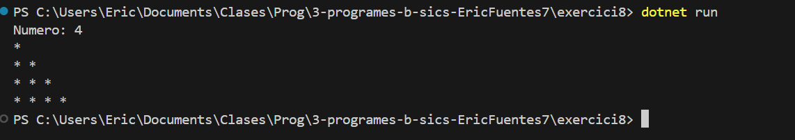

# Exercici 9
Aquest exercici és bàsicament una còpia i modificació de l’exercici del "la", però canviant els caràcters: 'l' i 'a' per ' ' i 'a', perquè quan hi hagi un espai i 'a', en compti un. A més, verifica si el primer caràcter de la frase és a i també compta (perquè si insereixo "avio", compti, encara que no tingui un " ").  
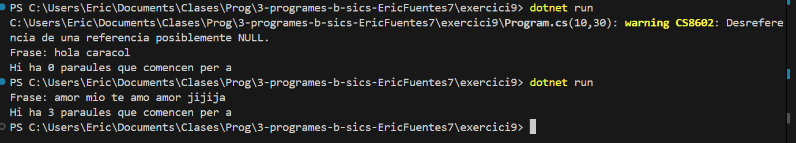

# Exercici 10
En aquest exercici el que es fa és invertir la frase ingressada per l’usuari. Això ho faig amb un for de la mida de la frase, que vagi restant a i-- (per tant, analitza la frase de final a principi). I assignarem una variable amb els caràcters de i (+= perquè s’agreguin).  
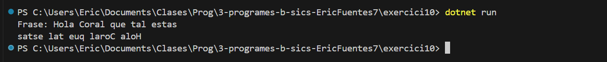

# Exercici 11
Aquest programa el que fa és eliminar els caràcters "u", "s" i "a", això ho fa amb un .Contains. Analitza amb un bucle la frase i fa un if de si aquell i no conté algun element de l’array de caràcters, l’afegeix a una variable.  
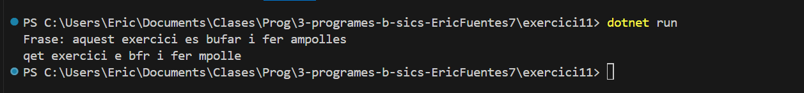

# Exercici 12
El que fa és crear taula de multiplicar de l’1 al 10. Això ho farem amb un while, que va executant cada taula; quan arriba a un, va a l’altre.  
(Mentre documento això veig que hauria sigut més fàcil un for a dins d’un altre for, un per al primer valor i l’altre per al segon. He creat amb el for i he comentat la forma amb el while.)  
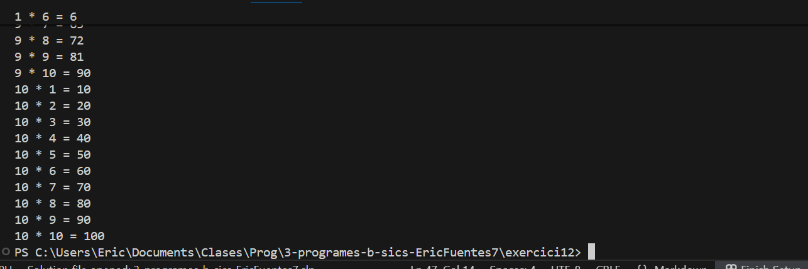

# Exercici 13
Aquest exercici fa el mateix que la piràmide, però he canviat que sigui fins a una entrada dinàmica per l’usuari a una fixa de 50, canviant el text de "* " per la i.  
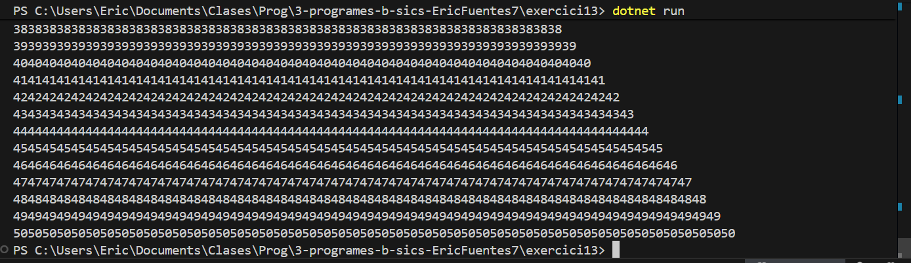

# Exercici 14
Aquest exercici també és bastant fotut. He creat un for de dues dimensions (dos fors), un és per la línia i l’altre pels punts que hi aniran. A dins he fet uns ifs, que detecten si és el primer de j; si ho és, assigna *, si no, espai, i si és l’últim del bucle, també *.  
El mateix amb el primer, però a dalt i a baix; si és el primer i o últim, assigna tot *.  
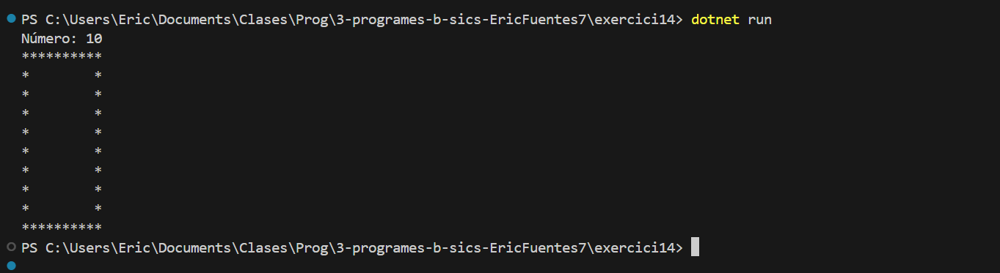
